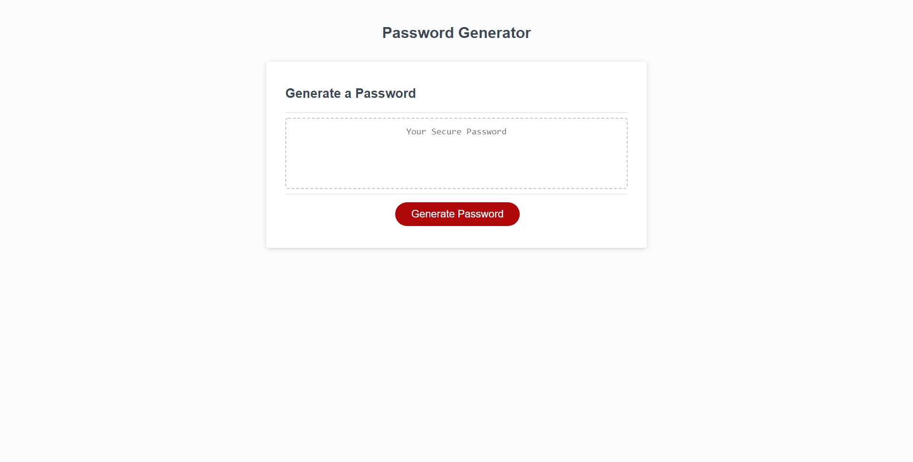
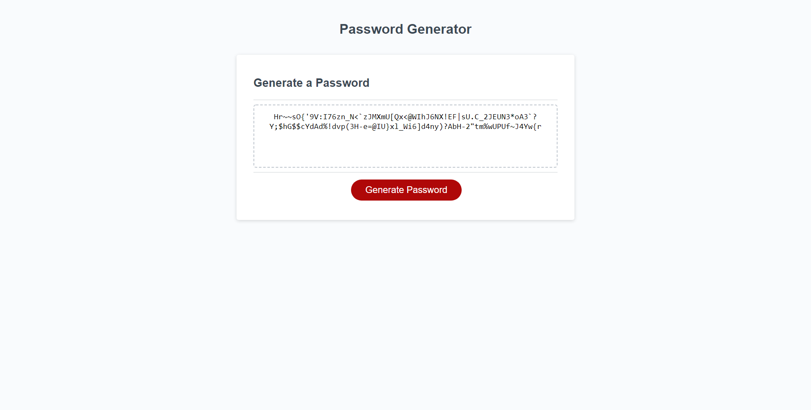

# Password Generator

## Description
- My motivation for this project was to randomly generate a password that meets certain criteria. As an employee with access to sensitive data, I will be able to generate a strong password that provides greater security. 
- This was accomplished through using JavaScript to add an event listener to the exisiting button, prompting the user to select their password criteria using confirm(), and creating a function that combines and randomizes user input to create the final password. 

## Screenshot

## Link
https://mistwhit.github.io/password-generator